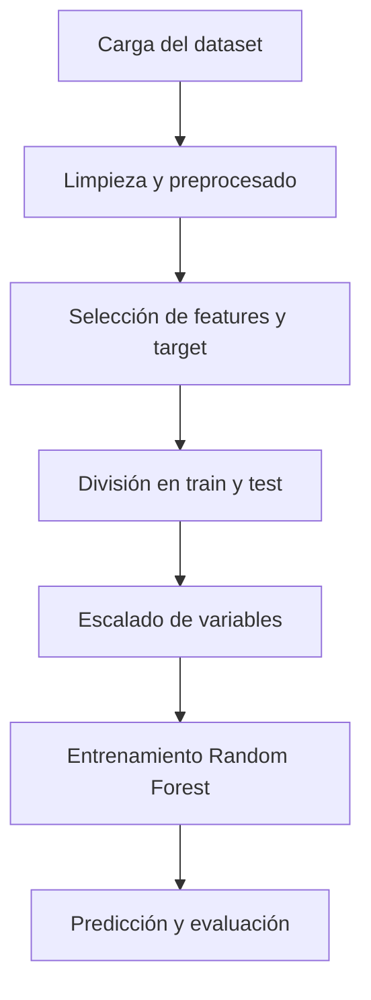

# Predicción de Supervivencia en el Titanic

---

## Introducción

Este proyecto aplica técnicas de **Machine Learning** para predecir si un pasajero del Titanic sobrevivió o no, utilizando un conjunto reducido de características (`Age` y `Fare`).
Se implementa un modelo de **Random Forest** y se evalúa su desempeño mediante métricas estándar de clasificación.

---

## Problema a resolver

El objetivo es realizar una **clasificación binaria**: determinar si un pasajero sobrevivió (`1`) o no (`0`) a partir de sus características.

- **Entradas:** Edad (`Age`) y tarifa pagada (`Fare`).
- **Salida:** Supervivencia (`Survived`).

Esto permite analizar patrones de supervivencia y la relación entre atributos y el resultado.

---

## Descripción del dataset utilizado

El dataset proviene de Kaggle y contiene información sobre los pasajeros del Titanic.

**Columnas principales:**

| Columna       | Descripción                          |
|---------------|--------------------------------------|
| PassengerId   | Identificador del pasajero           |
| Pclass        | Clase del pasajero                   |
| Name          | Nombre del pasajero                  |
| Sex           | Género del pasajero                  |
| Age           | Edad del pasajero                    |
| SibSp         | Hermanos / Cónyuges a bordo         |
| Parch         | Padres / Hijos a bordo               |
| Ticket        | Número de ticket                     |
| Fare          | Tarifa pagada                        |
| Cabin         | Cabina                               |
| Embarked      | Puerto de embarque                   |
| Survived      | Variable objetivo (0 = no, 1 = sí)  |

**Limpieza y preprocesado realizada:**

- Eliminación de columnas irrelevantes: `PassengerId`, `Name`, `Ticket`, `Cabin`.
- Imputación de valores faltantes:
  - `Age` y `Fare` → mediana
  - `Embarked` → moda
- Conversión de variables categóricas a numéricas:
  - `Sex` → 0 = male, 1 = female
  - `Embarked` → one-hot encoding

---

## Descripción del Pipeline

El flujo de trabajo del modelo se puede representar con **Mermaid**:



## Resultados obtenidos

**Métricas del modelo:**

| Métrica   | Valor aproximado |
|-----------|----------------|
| Accuracy  | 0.80           |
| Precision | 0.79           |
| Recall    | 0.77           |
| F1-score  | 0.78           |

- La matriz de confusión muestra que el modelo predice correctamente la mayoría de los casos.
- Random Forest captura relaciones no lineales entre **Age** y **Fare** y la supervivencia.

---

## Uso del modelo

**Para predecir un nuevo pasajero:**

```python
# Ejemplo con edad 28 y tarifa 72.5
rf.predict([[28, 72.5]])  # Devuelve 0 = no sobrevivió
